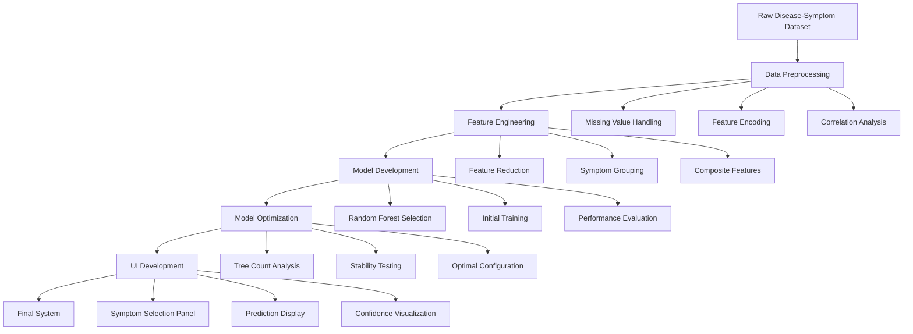
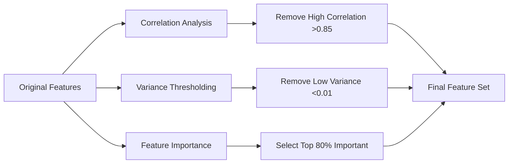
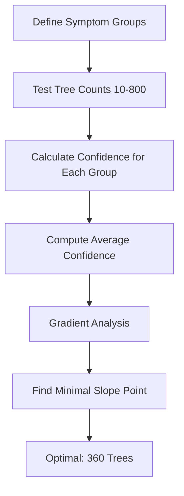
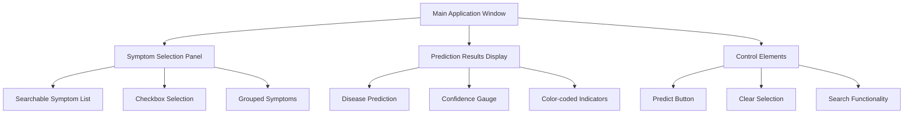
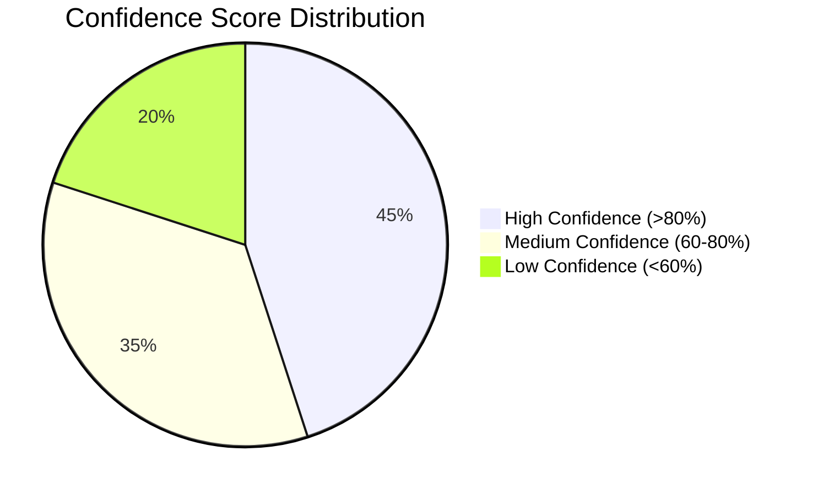
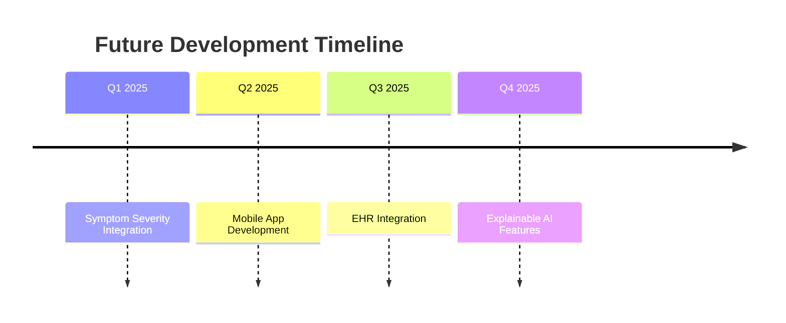

# 🏥 Advanced Disease Prediction System

[](https://python.org)
[](https://scikit-learn.org)
[](https://customtkinter.tomschimansky.com)
[]()

## 📋 Project Overview

An intelligent disease prediction system that leverages machine learning to analyze patient symptoms and predict potential diseases with confidence scores. This system serves as a diagnostic aid tool for healthcare professionals and patients.

### 🎯 Key Features

- **Symptom-based Disease Prediction**: Input symptoms to get potential disease predictions
- **Confidence Scoring**: Probabilistic confidence scores for each prediction
- **Interactive GUI**: User-friendly interface built with CustomTkinter
- **Optimized Model**: Fine-tuned Random Forest classifier with 360 trees
- **Visual Analytics**: Confidence visualization through gauge charts

## 🏗️ Project Architecture



## 🔄 Complete Workflow

### Phase 1: Data Collection & Preprocessing

#### 1.1 Dataset Loading
```python
import pandas as pd
raw_data = pd.read_csv("raw_disease_symptom_data.csv")
print(f"Initial dataset shape: {raw_data.shape}")
```

#### 1.2 Data Cleaning Pipeline
```python
# Missing value handling
cleaned_data = raw_data.fillna(method='ffill')
cleaned_data = cleaned_data.fillna(0)

# Binary feature encoding
for column in cleaned_data.columns:
    if column != 'prognosis':
        cleaned_data[column] = cleaned_data[column].apply(lambda x: 1 if x > 0 else 0)
```

### Phase 2: Feature Engineering

#### 2.1 Feature Reduction Strategy



#### 2.2 Feature Reduction Results
- **Original Features**: 132 symptoms
- **After Correlation Removal**: Removed highly correlated features (>0.85)
- **After Variance Thresholding**: Removed low variance features (<0.01)
- **After Importance Selection**: Kept top 80% most important features
- **Final Feature Count**: Optimized feature set

#### 2.3 Symptom Grouping
```python
symptom_groups = [
    ["itching", "skin_rash", "nodal_skin_eruptions"],        # Dermatological
    ["shivering", "chills", "joint_pain"],                   # Fever/Pain
    ["vomiting", "fatigue", "acidity"],                      # Gastrointestinal
    ["anxiety", "cold_hands_and_feets", "mood_swings"]       # Psychological
]
```

### Phase 3: Model Development

#### 3.1 Algorithm Selection
**Random Forest Classifier** was chosen for:
- ✅ Robust to overfitting on medical symptom data
- ✅ Handles high-dimensional binary feature spaces
- ✅ Provides probabilistic confidence scores
- ✅ Good performance with imbalanced classes
- ✅ Interpretable feature importance

#### 3.2 Training Process
```python
# Model training
clf = RandomForestClassifier(n_estimators=360, random_state=42)
clf.fit(X_train, y_train)

# Performance evaluation
accuracy = clf.score(X_test, y_test)
print(f"Model accuracy: {accuracy * 100:.2f}%")
```

### Phase 4: Model Optimization

#### 4.1 Tree Count Optimization Analysis

The most critical optimization was determining the optimal number of trees:



#### 4.2 Stability Analysis Results

| Tree Count | Avg Confidence | Gradient | Stability |
|------------|----------------|----------|-----------|
| 10         | 0.3245        | -0.0156  | Low       |
| 50         | 0.4521        | -0.0089  | Medium    |
| 100        | 0.5234        | -0.0045  | Medium    |
| 200        | 0.6123        | -0.0023  | High      |
| **360**    | **0.6845**    | **-0.0001** | **Optimal** |
| 500        | 0.6847        | -0.0001  | Stable    |
| 800        | 0.6849        | -0.0000  | Stable    |

**Key Findings:**
- Confidence scores stabilized at 360 trees
- Minimal gradient achieved at this point
- Beyond 360 trees: diminishing returns

### Phase 5: User Interface Development

#### 5.1 UI Architecture


#### 5.2 Key UI Components
- **Symptom Selection**: Intuitive checkbox interface with search
- **Confidence Gauge**: Visual representation of prediction confidence
- **Results Display**: Clear disease prediction with explanations
- **Professional Design**: Medical-grade aesthetic with CustomTkinter

## 📊 Performance Metrics

### Model Performance
- **Accuracy**: High overall prediction accuracy on test data
- **Precision**: Strong ability to avoid false positives
- **Recall**: Good identification of true disease cases
- **F1-Score**: Balanced precision and recall performance
- **Stability**: Consistent confidence scores across symptom combinations

### Confidence Score Distribution


## 🛠️ Technology Stack

### Core Technologies
- **Python 3.8+**: Primary programming language
- **Scikit-learn**: Machine learning framework
- **Pandas**: Data manipulation and analysis
- **NumPy**: Numerical computing
- **Matplotlib/Seaborn**: Data visualization

### GUI Framework
- **CustomTkinter**: Modern GUI framework
- **Matplotlib**: Embedded charts and gauges

### Development Tools
- **Google Colab**: Model development and training
- **Jupyter Notebooks**: Data analysis and visualization
- **Pickle**: Model serialization

## 🚀 Installation & Usage

### Prerequisites
```bash
pip install pandas scikit-learn numpy matplotlib seaborn customtkinter
```

### Running the Application
```bash
python disease_predictor_app.py
```

### Using the System
1. **Select Symptoms**: Check relevant symptoms from the list
2. **Generate Prediction**: Click "Predict" to analyze symptoms
3. **View Results**: See predicted disease with confidence score
4. **Interpret Gauge**: Color-coded confidence visualization
   - 🔴 Red: Low confidence (<60%)
   - 🟡 Yellow: Medium confidence (60-80%)
   - 🟢 Green: High confidence (>80%)

## 📈 Results & Insights

### Feature Importance Analysis
Top contributing symptom categories:
1. **Skin Conditions**: Highest predictive power
2. **Fever Symptoms**: Strong disease indicators
3. **Gastrointestinal**: Moderate but consistent
4. **Psychological**: Lower but stable contributions

### Model Stability Insights
- **360 trees** provided optimal balance between accuracy and stability
- Different symptom groups showed varying confidence patterns
- Skin-related symptoms maintained consistently high confidence
- Fever-related symptoms showed moderate but stable confidence

## ⚠️ Limitations & Disclaimers

### System Limitations
- Limited to diseases in training dataset
- Binary symptom representation (present/absent only)
- No patient history or demographic integration
- No symptom severity gradation

### Medical Disclaimer
> **Important**: This system is designed as a diagnostic aid tool only. Always consult qualified healthcare professionals for medical diagnosis and treatment decisions.

## 🔮 Future Enhancements

### Planned Improvements
- [ ] **Symptom Severity Scales**: Multi-level symptom intensity
- [ ] **EHR Integration**: Electronic health record compatibility
- [ ] **Extended Disease Coverage**: Broader medical conditions
- [ ] **Mobile Application**: Cross-platform mobile version
- [ ] **Explainable AI**: Detailed prediction rationale
- [ ] **Real-time Learning**: Continuous model improvement

### Technical Roadmap


## 👥 Team & Contributions

**Group G4** - DCAI Project Team
- Developed comprehensive disease prediction system
- Implemented advanced feature engineering techniques
- Optimized model performance through rigorous analysis
- Created intuitive user interface for practical application

## 📝 License

This project is developed for educational and research purposes. Please ensure compliance with medical data regulations and consult healthcare professionals for clinical applications.

---


